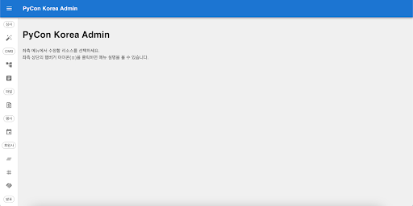
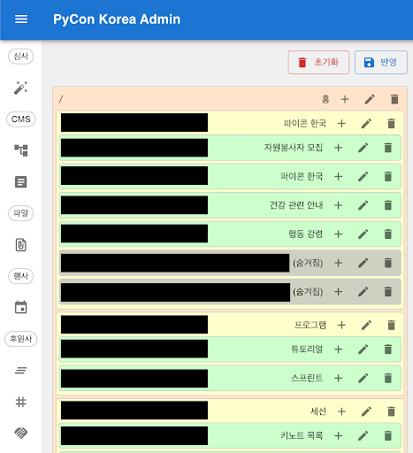
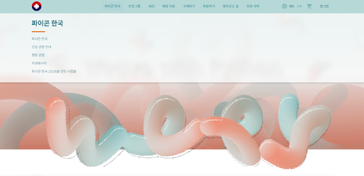
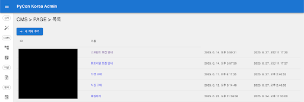
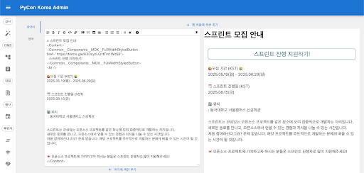

# 2025 어드민 CMS 가이드

## CMS란

CMS는 유저가 직접 코드를 수정하지 않고도 웹사이트의 내용을 생성, 수정, 변경할 수 있게 해 주는 소프트웨어다. 파준위에서도 매 년도 홈페이지를 개발할 때 홈페이지의 세부 내용(텍스트 변경, 텍스트 간 위치 변경, 페이지 소속 변경 등)이 변경되는 경우가 종종 있었다. 이때 개발자가 해당 레포의 코드를 직접 수정해야 해서 반영이 늦어지거나 번거로운 문제가 있었다. 이 문제를 해결하고자 자체 CMS 기능을 구현하였다.

그렇다면 CMS를 사용해서 어떻게 특정 년도의 파이콘 홈페이지를 수정할 수 있을지 살펴보자.

## 홈 화면

아래는 CMS 홈페이지의 홈 화면이다. 콘텐츠를 편집하고 싶다면 우선 로그인을 해야 한다. 아이디와 비밀번호를 만들지 않았다면 홈페이지 팀에 문의하면 된다.

## CMS 메뉴

CMS 홈페이지에는 CMS 기능 외에도 다른 메뉴들이 있지만, 본 문서에서는 CMS 기능인 ‘사이트맵’과 ‘페이지’에 대해서만 다룰 예정이다.

## 사이트맵

홈페이지의 메뉴를 눌렀을 때 보여지는 메뉴를 편집할 수 있다.

위와 같은 사이트맵 메뉴는 아래와 같은 메뉴 구조로 나타난다. ‘+’ 버튼을 눌러서 해당 사이트맵 하위에 새 사이트맵을 추가할 수도 있고, 해당 사이트맵을 편집 또는 삭제할 수도 있다.

## 페이지

사이트맵에서 메뉴를 누르게 되면 실제로 이동할 페이지를 생성, 수정, 삭제할 수 있다.

## 섹션

페이지는 1개 이상의 섹션으로 구성되어 있다. 페이지에 다양한 내용을 포함해야 할 때 구분하기 위해서 사용한다.

예를 들면 ‘스프린트 모집 안내’ 페이지는 아래와 같이 구성되어 있다. 왼쪽의 MDX 문법을 사용하는 에디터에서 내용을 입력하면, 오른쪽 창에서는 실제 홈페이지에 내용이 어떻게 표시될지를 보여준다.

