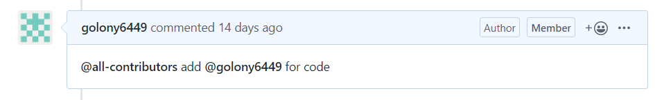

## 스크립트 오탈자 수정 방법과 수정 내용의 반영

 파이콘 한국은 보다 많은 분들이 참여할 수 있는 행사가 되기 위해 2018년부터 문자통역을 제공하고 있습니다. 또한, 이때 만들어진 스크립트를 기반으로 [Youtube](https://www.youtube.com/channel/UC26x6D5xpKx6io4ShfXa_Ow)에 업로드된 발표 영상에 자막으로 추가하는 작업을 진행 중입니다.

 발표 스크립트를 편집하고, 영상에 자막을 첨부하는 작업은 많은 시간이 필요한 작업이고 여러분들의 도움을 필요로 합니다.

### 스크립트의 오탈자를 수정하는 방법

아래의 Github 저장소를 참고 해주세요.

* https://github.com/pythonkr/pyconkr-script

### 수정된 내용들을 반영하기

 기여자분들께서 기여해 주신 내용과 보내주신 PR은 파이콘 한국 준비위원회에서 검토한 다음 반영합니다. 이때 중점적으로 확인하는 부분은 다음과 같습니다.

* PR 템플릿에 기재된 항목
  *  PR(Pull Request) 전에 이슈를 먼저 생성해주세요.
  *  중복된 PR이 없는지 확인해주세요.
  *  적절한 파일 제목을 입력해주세요. 빠른 반영에 큰 도움이 됩니다.
  *  파일 이름이 변경되지 않았는지 확인해주세요. 변경되었다면 원래의 파일명으로 수정한 뒤 제출 부탁드립니다.
  *  [CoC](https://github.com/pythonkr/pycon-code-of-conduct)에 부적절한 내용은 없는지 확인해주세요. CoC에 위반한 내용이 있다면 `Reject` 될 수 있습니다.
  *  스크립트의 일부분을 수정 기여하셨다면, 스크립트 내에 검수한 부분을 표시해주세요.
    - 검수한 스크립트 내용 앞에 줄을 추가해 `(여기부터 검수 시작)` 을 적어주시고 검수한 내용 마지막 줄에 `(여기까지 검수 완료)` 를 추가해 적어주세요.
    - 모든 내용이 검수 완료된 스크립트는 마지막 줄에 `(검수 완료)` 라고 적어주세요.
  *  Maintainer가 수정할 수 있도록 `Allow edits from maintainers` 항목을 체크해주세요.

### all-contributors

 [all-contributors](https://github.com/all-contributors/all-contributors)는 All Contributors는 오픈 소스 프로젝트의 기여자를 인정하는 방법 중 하나입니다. 기여자분께서 편집 후 PR을 보내주시면, 파이콘 한국 준비위원회에서는 이를 검토한 후 `all-contributors bot`을 사용해 기여 테이블에 추가합니다.

#### 방법

1. 해당 PR의 코멘트에 `@all-contributors add 계정명 for document`을 추가합니다.

   * 이때 `for document`는 생략할 수 있습니다. (기여의 유형을 기재하는 부분입니다.)

   

2. `all-contributors 봇`이 기여 테이블을 생성해 새로운 PR을 생성해줍니다.

   

3. 이후 검토가 완료된 PR와 봇이 생성한 PR 2개를 Merge하면 완료됩니다.

